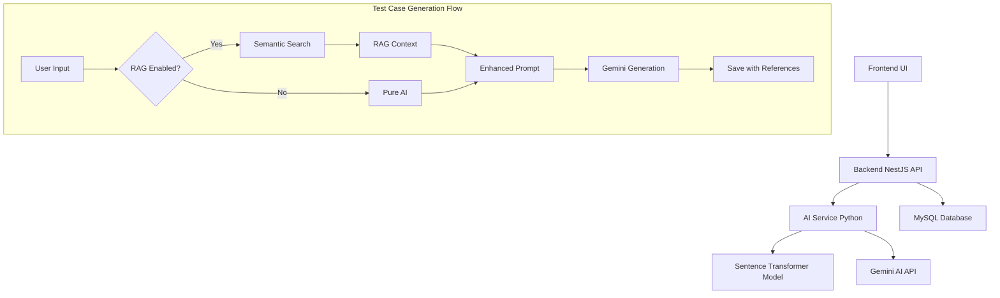

# Frontend Development Guidelines - Test Case Management with RAG

## 🎯 Overview

Frontend aplikasi Test Case Management dengan fitur AI Generation yang mendukung RAG (Retrieval-Augmented Generation). Dokumen ini memberikan panduan lengkap untuk mengintegrasikan frontend dengan backend API yang sudah tersedia.

## 🏗️ Architecture Overview



## 🌐 Backend API Endpoints

### Test Case Management

| Endpoint | Method | Description | RAG Support |
|----------|--------|-------------|-------------|
| `/testcases` | GET | Get all test cases | ❌ |
| `/testcases` | POST | Create new test case | ❌ |
| `/testcases/:id` | GET | Get specific test case | ❌ |
| `/testcases/:id` | PATCH | Update test case | ❌ |
| `/testcases/:id` | DELETE | Delete test case | ❌ |
| `/testcases/search` | GET | Semantic search | ✅ |
| `/testcases/generate-with-ai` | POST | Generate (preview only) | ✅ |
| `/testcases/generate-and-save-with-ai` | POST | Generate and save | ✅ |
| `/testcases/:id/with-reference` | GET | Get with references | ✅ |
| `/testcases/:id/derived` | GET | Get derived test cases | ❌ |
| `/testcases/derive/:referenceId` | POST | Create derived test case | ❌ |

## 📱 UI Components Requirements

### 1. Test Case List View
```typescript
interface TestCaseListItem {
  id: string;
  name: string;
  description: string;
  type: 'positive' | 'negative';
  priority: 'high' | 'medium' | 'low';
  tags: string[];
  aiGenerated: boolean;
  aiGenerationMethod?: 'pure_ai' | 'rag';
  createdAt: string;
  updatedAt: string;
}
```

**UI Elements:**
- Badge untuk AI-generated test cases
- Icon untuk RAG vs Pure AI
- Filter by AI generation method
- Search bar dengan semantic search capability

### 2. AI Generation Form
```typescript
interface AIGenerationForm {
  prompt: string;
  context?: string;
  preferredType?: 'positive' | 'negative';
  preferredPriority?: 'high' | 'medium' | 'low';
  
  // RAG Settings
  useRAG: boolean;
  ragSimilarityThreshold: number; // 0-1, default 0.7
  maxRAGReferences: number; // 1-10, default 3
}
```

**UI Elements:**
- Rich text input untuk prompt
- Toggle switch untuk enable/disable RAG
- Advanced settings collapsible section:
  - Slider untuk similarity threshold
  - Number input untuk max references
- Preview mode vs Save directly
- Progress indicator untuk AI processing

### 3. RAG References Display
```typescript
interface RAGReference {
  testCaseId: string;
  similarity: number;
  testCase: {
    id: string;
    name: string;
    type: string;
    priority: string;
    tags: string[];
  };
}
```

**UI Elements:**
- Card layout untuk setiap reference
- Similarity score dengan visual indicator (progress bar/stars)
- Link to original test case
- Expandable detail view

### 4. Test Case Detail View
```typescript
interface TestCaseDetail {
  // Basic fields
  id: string;
  name: string;
  description: string;
  type: 'positive' | 'negative';
  priority: 'high' | 'medium' | 'low';
  steps: Array<{
    step: string;
    expectedResult: string;
  }>;
  expectedResult: string;
  tags: string[];
  
  // AI Metadata
  aiGenerated: boolean;
  originalPrompt?: string;
  aiConfidence?: number;
  aiSuggestions?: string;
  aiGenerationMethod?: 'pure_ai' | 'rag';
  
  // References
  references?: Array<{
    id: string;
    targetId: string;
    similarityScore?: number;
    referenceType: 'manual' | 'rag_retrieval';
    target: {
      id: string;
      name: string;
      type: string;
      priority: string;
    };
  }>;
  
  derivedCount?: number;
  createdAt: string;
  updatedAt: string;
}
```

**UI Elements:**
- AI generation metadata section (collapsible)
- RAG references section with similarity scores
- Original prompt display (if AI-generated)
- AI confidence indicator
- Links to referenced test cases
- "Generate Similar" button untuk create derived test cases

## 🔧 Implementation Details

### 1. API Integration

#### Generate Test Case with RAG
```typescript
const generateTestCase = async (formData: AIGenerationForm) => {
  const response = await fetch('/api/testcases/generate-with-ai', {
    method: 'POST',
    headers: {
      'Content-Type': 'application/json',
    },
    body: JSON.stringify(formData)
  });
  
  if (!response.ok) {
    throw new Error('Failed to generate test case');
  }
  
  return response.json();
};
```

#### Generate and Save
```typescript
const generateAndSave = async (formData: AIGenerationForm) => {
  const response = await fetch('/api/testcases/generate-and-save-with-ai', {
    method: 'POST',
    headers: {
      'Content-Type': 'application/json',
    },
    body: JSON.stringify(formData)
  });
  
  return response.json();
};
```

#### Semantic Search
```typescript
const semanticSearch = async (query: string, minSimilarity = 0.7, limit = 10) => {
  const params = new URLSearchParams({
    query,
    minSimilarity: minSimilarity.toString(),
    limit: limit.toString()
  });
  
  const response = await fetch(`/api/testcases/search?${params}`);
  return response.json();
};
```

### 2. State Management

#### Redux/Zustand Store Structure
```typescript
interface TestCaseState {
  // Basic CRUD
  testCases: TestCaseListItem[];
  selectedTestCase: TestCaseDetail | null;
  loading: boolean;
  error: string | null;
  
  // AI Generation
  generationLoading: boolean;
  generationPreview: TestCaseDetail | null;
  ragReferences: RAGReference[];
  
  // Search
  searchResults: SearchResult[];
  searchLoading: boolean;
  
  // Filters
  filters: {
    type?: 'positive' | 'negative';
    priority?: 'high' | 'medium' | 'low';
    aiGenerated?: boolean;
    aiGenerationMethod?: 'pure_ai' | 'rag';
    tags?: string[];
  };
}
```

### 3. Form Validation

#### AI Generation Form
```typescript
const validationSchema = {
  prompt: {
    required: true,
    minLength: 10,
    maxLength: 1000
  },
  ragSimilarityThreshold: {
    min: 0,
    max: 1,
    step: 0.1
  },
  maxRAGReferences: {
    min: 1,
    max: 10,
    integer: true
  }
};
```

## 🎨 UI/UX Guidelines

### 1. Visual Indicators

#### AI Generation Method
- **Pure AI**: 🤖 Robot icon with blue color
- **RAG**: 🔗 Connected nodes icon with green color
- **Manual**: 👤 User icon with gray color

#### Similarity Scores
- **High (0.8-1.0)**: Green progress bar
- **Medium (0.6-0.79)**: Yellow progress bar  
- **Low (0.4-0.59)**: Orange progress bar
- **Very Low (<0.4)**: Red progress bar

#### AI Confidence
- Visual progress circle
- Color coding: Red → Yellow → Green
- Textual description: Low/Medium/High confidence

### 2. User Flow

#### Standard Test Case Creation
1. User clicks "Create New Test Case"
2. Fills manual form or chooses "Generate with AI"
3. If AI: Configure RAG settings
4. Preview generated result
5. Edit if needed
6. Save to database

#### RAG-Enhanced Generation
1. User enters prompt
2. System shows RAG toggle (enabled by default)
3. Advanced settings available (threshold, max references)
4. Click "Generate Preview"
5. Show loading with progress
6. Display generated test case with RAG references
7. User can see which test cases influenced the generation
8. Option to regenerate with different settings
9. Save or edit before saving

### 3. Error Handling

#### Common Error Scenarios
- AI service unavailable → Show fallback manual creation
- No similar test cases found → Inform user, switch to pure AI
- Low confidence score → Warning with suggestion to review
- API key issues → Admin notification

#### Error Messages
```typescript
const errorMessages = {
  AI_SERVICE_DOWN: "AI service is temporarily unavailable. You can still create test cases manually.",
  NO_RAG_RESULTS: "No similar test cases found. Generated using pure AI instead.",
  LOW_CONFIDENCE: "AI confidence is low. Please review the generated content carefully.",
  INVALID_PROMPT: "Please provide a more detailed prompt for better results."
};
```

## 📊 Analytics & Metrics

### Dashboard Metrics to Display
- Total test cases created
- AI vs Manual creation ratio
- RAG vs Pure AI usage
- Average similarity scores
- Most referenced test cases
- AI confidence distribution

### Usage Tracking
```typescript
interface UsageMetrics {
  totalGenerated: number;
  ragUsage: number;
  pureAiUsage: number;
  averageConfidence: number;
  averageSimilarity: number;
  topReferencedTestCases: Array<{
    id: string;
    name: string;
    referenceCount: number;
  }>;
}
```

## 🔍 Search & Filter Implementation

### Advanced Search Features
- Semantic search bar (powered by embeddings)
- Filter by AI generation method
- Filter by reference count
- Filter by confidence score range
- Sort by similarity, date, confidence

### Search UI Components
```typescript
interface SearchFilters {
  query?: string;
  type?: 'positive' | 'negative';
  priority?: 'high' | 'medium' | 'low';
  aiGenerated?: boolean;
  aiGenerationMethod?: 'pure_ai' | 'rag';
  minConfidence?: number;
  hasReferences?: boolean;
  tags?: string[];
  dateRange?: {
    start: Date;
    end: Date;
  };
}
```

## 🧪 Testing Requirements

### Unit Tests
- Component rendering with different props
- Form validation logic
- API integration functions
- State management actions

### Integration Tests
- Complete AI generation flow
- RAG reference display
- Search functionality
- Error handling scenarios

### E2E Tests
- Full test case creation workflow
- AI generation with RAG enabled/disabled
- Search and filter operations
- Reference navigation

## 📱 Responsive Design

### Breakpoints
- Mobile: < 768px
- Tablet: 768px - 1024px  
- Desktop: > 1024px

### Mobile Considerations
- Collapsible RAG settings
- Simplified reference display
- Touch-friendly similarity indicators
- Swipe gestures for navigation

## 🔒 Security Considerations

### Input Validation
- Sanitize AI prompts
- Validate RAG parameters
- Rate limiting for AI generation
- CSRF protection

### API Security
- Authentication required for all operations
- Rate limiting per user
- Input validation on backend
- Audit logging for AI usage

---

## 🚀 Getting Started Checklist

### For Frontend Developers

1. **Setup Environment**
   - [ ] Clone repository
   - [ ] Install dependencies
   - [ ] Configure environment variables
   - [ ] Verify backend API connection

2. **Implement Core Features**
   - [ ] Test case list with AI indicators
   - [ ] AI generation form with RAG settings
   - [ ] RAG references display
   - [ ] Semantic search integration

3. **Advanced Features**
   - [ ] Real-time generation preview
   - [ ] Similarity score visualization
   - [ ] Reference navigation
   - [ ] Analytics dashboard

4. **Testing & Polish**
   - [ ] Unit tests for components
   - [ ] Integration tests for API
   - [ ] E2E tests for workflows
   - [ ] Responsive design testing

### API Endpoints Summary

```typescript
// Core CRUD
GET    /testcases                     // List all test cases
POST   /testcases                     // Create new test case
GET    /testcases/:id                 // Get specific test case
PATCH  /testcases/:id                 // Update test case
DELETE /testcases/:id                 // Delete test case

// AI & RAG Features  
POST   /testcases/generate-with-ai               // Generate preview
POST   /testcases/generate-and-save-with-ai      // Generate and save
GET    /testcases/search                         // Semantic search
GET    /testcases/:id/with-reference             // Get with references
GET    /testcases/:id/derived                    // Get derived test cases
POST   /testcases/derive/:referenceId            // Create derived
```

## 📚 Additional Resources

- **Backend Documentation**: `./Tech.md`
- **API Examples**: `./examples.md`
- **Prompt Engineering**: `./prompt-lesson-learned.md`
- **Project Plan**: `./rencana.md`

---

**Happy coding! 🎉** 

Untuk pertanyaan atau klarifikasi, silakan merujuk ke dokumentasi API atau hubungi tim backend.
